# MediStock — Smart HAS

**Back-end de gestão de estoque hospitalar com persistência Oracle e integração PL/SQL.**

O MediStock organiza hospitais, insumos, históricos de consumo, entregas e transferências. Esta entrega estende a aplicação Java com um modelo relacional Oracle, uma carga de dados simulados e uma procedure para registrar consumo a partir da API.

**Ambiente da demonstração:** Windows, Java 25, Spring Boot, Oracle Database Free e SQL Developer. As evidências foram capturadas em **26/09/2026** em ambiente local, com dados de demonstração.

[Como executar](#execucao) · [Modelo de dados](#modelo) · [PL/SQL](#plsql) · [Testes](#testes) · [12 evidências](#evidencias)

<a id="objetivo"></a>
## Objetivo da atividade

Integrar o banco Oracle ao sistema Smart HAS, representado neste projeto pelo MediStock, conectando os conceitos de modelagem relacional e PL/SQL ao back-end.

| Requisito | Implementação e material de apoio |
| --- | --- |
| Criar ou adaptar o modelo lógico e físico | Seis entidades, chaves primárias, chaves estrangeiras, restrições e índices. [DER](docs/DER_MediStock.png) e [dicionário de dados](docs/MODELO_E_DICIONARIO.md). |
| Implantar as tabelas no Oracle | Schema `MEDISTOCK` no serviço `FREEPDB1`; scripts em [database/oracle](database/oracle). |
| Importar dados simulados relevantes ao domínio | Carga de hospitais, itens de estoque, históricos, entregas e transferências. |
| Documentar a estrutura do banco | DER em PNG, SVG e Mermaid, dicionário completo das colunas e instruções de execução. |
| Conectar PL/SQL ao back-end | Fluxo de registro de consumo integrado à procedure `PR_REGISTRAR_CONSUMO`. |

## Tecnologias e organização

| Componente | Uso |
| --- | --- |
| Java 25 | Linguagem e JDK usados pelo projeto. |
| Spring Boot 4.1.1 | Inicialização e configuração da API. |
| Spring Web | Endpoints REST. |
| Spring Data JPA / Hibernate | Entidades, consultas e persistência JPA. |
| Spring JDBC / `JdbcTemplate` | Chamada parametrizada à procedure Oracle. |
| Spring Security / JWT | Autenticação e proteção dos endpoints. |
| Oracle Database Free 26ai | Banco relacional da demonstração. |
| Oracle JDBC `ojdbc17` 23.26.2.0.0 | Driver de conexão com o Oracle. |
| SQL Developer | Execução dos scripts e inspeção dos resultados. |
| Springdoc 3.1.1 / Swagger UI | Documentação e testes manuais da API. |
| Maven Wrapper | Build reproduzível pelo comando `mvnw.cmd`. |
| Antigravity | Apoio às alterações Java, revisão dos arquivos e diagnóstico do build. |

A API recebe as requisições e aplica a autenticação JWT. A camada de serviço valida as entradas e coordena a transação. No fluxo de consumo do perfil `oracle`, a persistência chama `PR_REGISTRAR_CONSUMO`, que valida as referências e insere em `HISTORICO_CONSUMO`.

Os demais cadastros e consultas continuam usando os repositórios JPA. A configuração original de SQLite pode ser usada sem o perfil `oracle`; os testes apresentados nesta entrega foram realizados no Oracle.

| Local | Conteúdo |
| --- | --- |
| `src/main/java/br/com/fiap/medistockbackend/` | Código da aplicação: controllers, serviços, entidades, repositórios e segurança. |
| `src/main/resources/application.properties` | Configuração comum da aplicação. |
| `src/main/resources/application-oracle.properties` | Conexão Oracle e validação do schema. |
| [database/oracle](database/oracle) | Scripts de implantação, carga e testes. |
| [docs/MODELO_E_DICIONARIO.md](docs/MODELO_E_DICIONARIO.md) | Tipos, colunas, chaves e decisões de modelagem. |
| [docs/evidencias](docs/evidencias) | Doze capturas da execução local. |
| [.env.example](.env.example) | Modelo de configuração local. |

<a id="modelo"></a>
## Modelo lógico e físico


[Abrir em SVG](docs/DER_MediStock.svg) · [Código Mermaid](docs/DER_MediStock.mmd) · [Dicionário completo](docs/MODELO_E_DICIONARIO.md)

| Tabela | Finalidade | Relações principais |
| --- | --- | --- |
| `USUARIOS` | Cadastro e autenticação; armazenamento do hash da senha. | E-mail institucional único. |
| `HOSPITAIS` | Cadastro dos hospitais da rede e suas coordenadas. | Referenciada pelo estoque e pelos registros operacionais. |
| `ITENS_ESTOQUE` | Insumos, quantidades, validade, custo e armazenamento. | `HOSPITAL_ID` → `HOSPITAIS.ID`. |
| `HISTORICO_CONSUMO` | Quantidades consumidas por item, hospital e referência temporal. | FKs para item e hospital. |
| `ENTREGAS` | Entregas previstas e seus estados logísticos. | FKs para item e hospital de destino. |
| `TRANSFERENCIAS` | Transferências entre hospitais. | FKs para item, hospital de origem e hospital de destino. |

Cada relacionamento é do tipo **1:N**: um pai pode ter vários registros associados; cada filho referencia um pai existente em cada chave estrangeira. O modelo contém **seis tabelas, 48 colunas e oito chaves estrangeiras**. `USUARIOS` é independente das demais tabelas nesta versão.

Decisões físicas:

- IDs gerados pelo Oracle com `GENERATED BY DEFAULT ON NULL AS IDENTITY`.
- `NUMBER(19,0)` para IDs, `NUMBER(10,0)` para quantidades e `NUMBER(12,2)` para custos.
- `VARCHAR2(... CHAR)` para textos, `DATE` para datas e `TIMESTAMP(6)` para data e hora.
- `BINARY_DOUBLE` para coordenadas e estimativas numéricas; `BOOLEAN` para indicadores.
- Restrições de integridade, e-mail único e oito índices de suporte, além dos índices das chaves primárias e da unicidade.
- O registro de histórico preserva o saldo de estoque. Ele representa o consumo informado para análise de demanda.

O DDL foi preparado para **Oracle Free 26ai**, inclusive quanto ao uso do tipo SQL `BOOLEAN`.

## Dados simulados

A carga inicial é executada pelo script [02_dados_simulados.sql](database/oracle/02_dados_simulados.sql).

| Tabela | Quantidade inicial |
| --- | ---: |
| `HOSPITAIS` | 3 |
| `ITENS_ESTOQUE` | 12 |
| `HISTORICO_CONSUMO` | 72 |
| `ENTREGAS` | 4 |
| `TRANSFERENCIAS` | 4 |
| `USUARIOS` | 0 |

São quatro itens por hospital e seis referências mensais por item. Os hospitais, endereços e operações da carga são fictícios. As datas da carga são calculadas em relação ao momento da execução.

O usuário da demonstração foi criado depois, pela API. Durante o teste de consumo, a contagem de históricos passou de **72 para 73**, conforme os anexos 10 e 11.

<a id="execucao"></a>
## Como executar

### 1. Preparar o ambiente

Instale o **JDK 25**, o **Oracle Database Free 26ai** e o **SQL Developer**. Abra uma cópia do projeto que contenha as alterações da integração Oracle. No Windows, os exemplos abaixo consideram a pasta `C:\Projetos\MediStock_Back`.

No PowerShell:

```powershell
Set-Location C:\Projetos\MediStock_Back
java -version
javac -version
.\mvnw.cmd -version
```

Confira se o Java utilizado pelo Maven também é o **25**. O Maven Wrapper obtém a distribuição Maven necessária ao projeto.

### 2. Preparar o Oracle

No SQL Developer, configure uma conexão administrativa:

| Campo | Valor |
| --- | --- |
| Usuário | `SYSTEM` |
| Senha | Definida durante a instalação do Oracle |
| Host | `localhost` |
| Porta | `1521` |
| Tipo de identificação | Nome do serviço |
| Serviço | `FREEPDB1` |
| Atribuição / role | Padrão |

Execute os scripts com **F5**, respeitando a conexão indicada:

| Ordem | Script | Conexão | Objetivo |
| --- | --- | --- | --- |
| 0 | [00_criar_usuario.sql](database/oracle/00_criar_usuario.sql) | `SYSTEM` / `FREEPDB1` | Criar o usuário/schema `MEDISTOCK` e conceder os privilégios utilizados. |
| 1 | [01_criar_tabelas.sql](database/oracle/01_criar_tabelas.sql) | `MEDISTOCK` / `FREEPDB1` | Criar tabelas, constraints, comentários e índices. |
| 2 | [02_dados_simulados.sql](database/oracle/02_dados_simulados.sql) | `MEDISTOCK` / `FREEPDB1` | Inserir a carga simulada. |
| 3 | [03_procedure_consumo.sql](database/oracle/03_procedure_consumo.sql) | `MEDISTOCK` / `FREEPDB1` | Criar ou atualizar a procedure. |
| 4 | [04_validar_banco.sql](database/oracle/04_validar_banco.sql) | `MEDISTOCK` / `FREEPDB1` | Consultar contagens, relacionamentos e validade dos objetos. |
| 5 | [05_testar_procedure.sql](database/oracle/05_testar_procedure.sql) | `MEDISTOCK` / `FREEPDB1` | Testar inserção, validações e rollback. |

No script 00, substitua `SUBSTITUA_POR_SUA_SENHA` na cópia executada localmente. Em seguida, crie uma nova conexão usando o usuário `MEDISTOCK`, a senha escolhida e o mesmo serviço `FREEPDB1`.

Os scripts 00, 01 e 02 são de **implantação inicial**. O 00 interrompe a execução se o usuário já existir; o 01 pressupõe tabelas ainda não criadas; o 02 exige as tabelas vazias. Em um ambiente já implantado, utilize as consultas e os testes apropriados ao estado atual.

### 3. Configurar a aplicação

Copie [.env.example](.env.example) para `.env`, ao lado de `pom.xml`, e preencha os valores locais:

```properties
ORACLE_URL=jdbc:oracle:thin:@//localhost:1521/FREEPDB1
ORACLE_USER=MEDISTOCK
ORACLE_PASSWORD=SUBSTITUA_PELA_SENHA_DO_MEDISTOCK
JWT_SECRET=SUBSTITUA_PELA_CHAVE_BASE64_GERADA
JWT_EXPIRACAO_MINUTOS=120
GEMINI_API_KEY=
```

Para gerar a chave JWT, execute no PowerShell e copie o resultado para `JWT_SECRET`:

```powershell
$jwtBytes = New-Object byte[] 32
$jwtRng = [System.Security.Cryptography.RandomNumberGenerator]::Create()
$jwtRng.GetBytes($jwtBytes)
[Convert]::ToBase64String($jwtBytes)
$jwtRng.Dispose()
```

O arquivo `.env` é importado como `.properties`: os valores são escritos sem aspas. Uma barra invertida literal no valor precisa ser escapada como `\\`.

Em `application.properties`, a importação e a configuração opcional da integração Gemini são:

```properties
spring.config.import=optional:file:.env[.properties]
medistock.gemini.api-key=${GEMINI_API_KEY:}
```

Os testes desta entrega utilizam autenticação, hospitais e histórico de consumo, sem depender de uma chave Gemini.

O arquivo `src/main/resources/application-oracle.properties` deve conter:

```properties
spring.datasource.url=${ORACLE_URL:jdbc:oracle:thin:@//localhost:1521/FREEPDB1}
spring.datasource.username=${ORACLE_USER:MEDISTOCK}
spring.datasource.password=${ORACLE_PASSWORD}
spring.datasource.driver-class-name=oracle.jdbc.OracleDriver
spring.jpa.database-platform=org.hibernate.dialect.OracleDialect
spring.jpa.properties.hibernate.dialect.oracle.use_binary_floats=true
spring.jpa.hibernate.ddl-auto=validate
spring.sql.init.mode=never
```

`ddl-auto=validate` faz o Hibernate conferir a compatibilidade entre as entidades e as tabelas implantadas pelos scripts SQL.

A dependência Oracle no `pom.xml` é:

```xml
<dependency>
    <groupId>com.oracle.database.jdbc</groupId>
    <artifactId>ojdbc17</artifactId>
    <version>23.26.2.0.0</version>
    <scope>runtime</scope>
</dependency>
```

### 4. Compilar e iniciar

```powershell
.\mvnw.cmd -DskipTests package
```

Após `BUILD SUCCESS`:

```powershell
.\mvnw.cmd "-Dspring-boot.run.profiles=oracle" spring-boot:run
```

Confirme no log que o perfil `oracle` está ativo. O comando de build acima pula a execução dos testes automatizados; as evidências desta entrega correspondem aos testes manuais da API e ao script de teste PL/SQL.

- API: [http://localhost:8080](http://localhost:8080)
- Swagger UI: [http://localhost:8080/docs](http://localhost:8080/docs)
- OpenAPI: [http://localhost:8080/v3/api-docs](http://localhost:8080/v3/api-docs)

<a id="plsql"></a>
## Procedure PL/SQL

O código completo está em [03_procedure_consumo.sql](database/oracle/03_procedure_consumo.sql).

```sql
PR_REGISTRAR_CONSUMO (
    p_item_estoque_id       IN NUMBER,
    p_hospital_id          IN NUMBER,
    p_mes_referencia       IN DATE,
    p_quantidade_consumida IN NUMBER
)
```

Essa é a assinatura da rotina; a criação do objeto deve ser feita pelo script completo.

| Parâmetro | Significado |
| --- | --- |
| `p_item_estoque_id` | Item de estoque ao qual o consumo se refere. |
| `p_hospital_id` | Hospital responsável pelo registro da demanda. |
| `p_mes_referencia` | Data de referência do consumo. |
| `p_quantidade_consumida` | Quantidade inteira e não negativa. |

A rotina utiliza condições `IF`, consultas `SELECT INTO`, `RAISE_APPLICATION_ERROR` e um `INSERT`. São conceitos de PL/SQL aplicados a uma operação do sistema.

| Código Oracle | Regra validada |
| --- | --- |
| `-20001` | IDs devem ser inteiros positivos e estar preenchidos. |
| `-20002` | Quantidade deve ser inteira, não negativa, preenchida e compatível com `Integer` do Java. |
| `-20003` | Data de referência deve estar preenchida. |
| `-20004` | O item de estoque deve existir. |
| `-20005` | O hospital deve existir. |

No Java, a chamada JDBC utiliza `{call PR_REGISTRAR_CONSUMO(?, ?, ?, ?)}`, preenchendo os parâmetros na ordem da assinatura. O serviço delimita a transação com `@Transactional`; a procedure deixa o controle de confirmação ou reversão para o chamador.

O endpoint aceita `mesReferencia` como `yyyy-MM` ou `yyyy-MM-dd`. No primeiro formato, o Java converte o valor para o primeiro dia do mês. A procedure preserva a data recebida.

Cada execução válida acrescenta um histórico. A operação não é idempotente: repetir o POST pode gerar outro registro. O modelo permite vários registros para a mesma combinação de item, hospital e mês.

<a id="testes"></a>
## Roteiro de testes

### Cadastro e autenticação

Em `POST /api/auth/registrar`, use dados de demonstração:

```json
{
  "primeiroNome": "Ana",
  "ultimoNome": "Demonstracao",
  "emailInstitucional": "ana.demo@fiap.com.br",
  "senha": "SenhaDemo2026!"
}
```

Resposta esperada: **HTTP 201**, com `token`, `tipo`, `expiraEmMinutos` e `usuario`. O domínio `fiap.com.br` está na configuração de domínios institucionais permitidos. Para um usuário já cadastrado, obtenha um novo token por `POST /api/auth/login`:

```json
{
  "emailInstitucional": "ana.demo@fiap.com.br",
  "senha": "SenhaDemo2026!"
}
```

No Swagger, clique em **Authorize**, cole somente o token no campo `bearerAuth`, confirme em **Authorize** e feche a janela. O Swagger acrescentará o cabeçalho `Authorization: Bearer <token>` às chamadas protegidas.

Execute `GET /api/hospitais`. O teste demonstrado retornou **HTTP 200** e os hospitais da carga simulada.

Para conferir o usuário no SQL Developer:

```sql
SELECT ID, PRIMEIRO_NOME, EMAIL_INSTITUCIONAL, CRIADO_EM
FROM USUARIOS
ORDER BY ID;
```

### Validade e testes da procedure

Na conexão `MEDISTOCK`:

```sql
SELECT OBJECT_NAME, STATUS
FROM USER_OBJECTS
WHERE OBJECT_NAME = 'PR_REGISTRAR_CONSUMO'
  AND OBJECT_TYPE = 'PROCEDURE';
```

Resultado esperado e observado: **`VALID`**.

Execute [05_testar_procedure.sql](database/oracle/05_testar_procedure.sql) com **F5**. O teste demonstrado produziu:

```text
OK: chamada valida inseriu um historico.
OK: quantidade negativa rejeitada.
OK: hospital inexistente rejeitado.
OK: ROLLBACK removeu o registro de teste. Contagem original preservada.
```

O script usa um savepoint e remove o registro de teste ao final. A identidade pode consumir números mesmo quando ocorre rollback; lacunas nos IDs não representam registros ausentes na contagem.

### Registro de consumo pela API

Primeiro, consulte IDs existentes e a contagem atual:

```sql
SELECT ID AS ITEM_ESTOQUE_ID, NOME, HOSPITAL_ID
FROM ITENS_ESTOQUE
ORDER BY ID
FETCH FIRST 5 ROWS ONLY;

SELECT COUNT(*) AS TOTAL
FROM HISTORICO_CONSUMO;
```

Em `POST /api/historico-consumo`, com o token autorizado:

```json
{
  "itemEstoqueId": 1,
  "hospitalId": 1,
  "mesReferencia": "2026-09",
  "quantidadeConsumida": 7
}
```

Adapte os IDs aos resultados da sua consulta. O contrato de sucesso do endpoint é **HTTP 201, sem corpo**. A implementação Oracle pode ser acompanhada pela mensagem `PR_REGISTRAR_CONSUMO executada` no log da aplicação.

Após a requisição, repita a contagem e confira os registros mais recentes:

```sql
SELECT COUNT(*) AS TOTAL
FROM HISTORICO_CONSUMO;

SELECT
    ID,
    ITEM_ESTOQUE_ID,
    HOSPITAL_ID,
    TO_CHAR(MES_REFERENCIA, 'YYYY-MM-DD') AS MES_REFERENCIA,
    QUANTIDADE_CONSUMIDA
FROM HISTORICO_CONSUMO
ORDER BY ID DESC
FETCH FIRST 5 ROWS ONLY;
```

Nas capturas desta execução, a contagem passou de **72 para 73**. O registro conferido possui **ID 221**, item **1**, hospital **1**, referência **2026-09-01** e quantidade **7**. O ID é gerado pelo banco e pode variar entre ambientes.

A rejeição de quantidade negativa está documentada no teste **direto da procedure**. A última imagem da entrega mostra a conferência do consumo válido persistido.

### Resultados documentados

| Verificação | Resultado observado | Anexos |
| --- | --- | --- |
| Cadastro pela API | HTTP 201 e emissão de JWT. | 1 e 2 |
| Persistência do usuário | Usuário encontrado em `USUARIOS`. | 3 |
| Autorização do Swagger | Estado `Authorized`. | 4 e 5 |
| Consulta protegida de hospitais | HTTP 200 e dados da carga simulada. | 6 |
| Compilação da procedure | Status `VALID`. | 7 |
| Inserção e validações PL/SQL | Inserção válida; quantidade negativa e hospital inexistente rejeitados. | 8 |
| Controle de transação | Rollback preservou a contagem original do teste SQL. | 8 |
| Persistência do consumo | Histórico de 72 para 73 registros; dados da inclusão conferidos. | 9 a 12 |

<a id="evidencias"></a>
## Evidências da execução

As doze capturas abaixo foram fornecidas pelo responsável pela execução local. Os dados de cadastro foram declarados fictícios e destinados à demonstração. A sequência reúne preparação de requisições, respostas da API e consultas no Oracle; cada legenda descreve o conteúdo visível da imagem.

<details>
<summary><strong>Anexo 1 — Cadastro de usuário pelo POST da API</strong></summary>

Preenchimento do corpo da requisição em `POST /api/auth/registrar`, com os campos do usuário de demonstração.

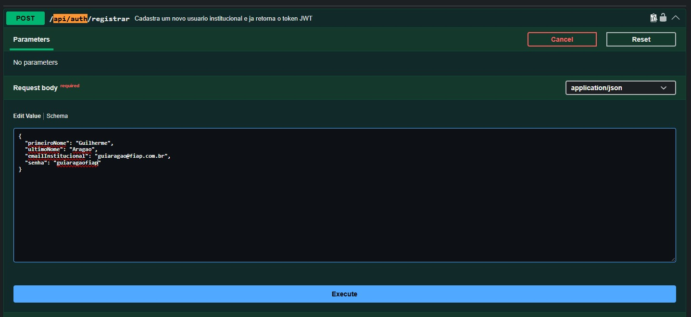

</details>

<details>
<summary><strong>Anexo 2 — Resposta HTTP 201 e geração do token</strong></summary>

A resposta do cadastro apresenta HTTP `201`, token JWT, tipo `Bearer`, prazo de expiração e dados do usuário cadastrado.

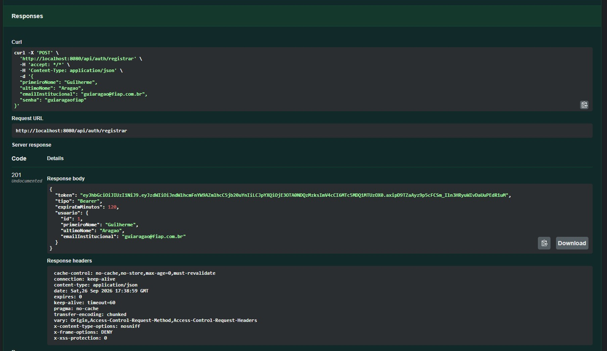

</details>

<details>
<summary><strong>Anexo 3 — Usuário persistido no Oracle</strong></summary>

A consulta à tabela `USUARIOS` retorna o usuário criado pela API, incluindo ID e data de criação.

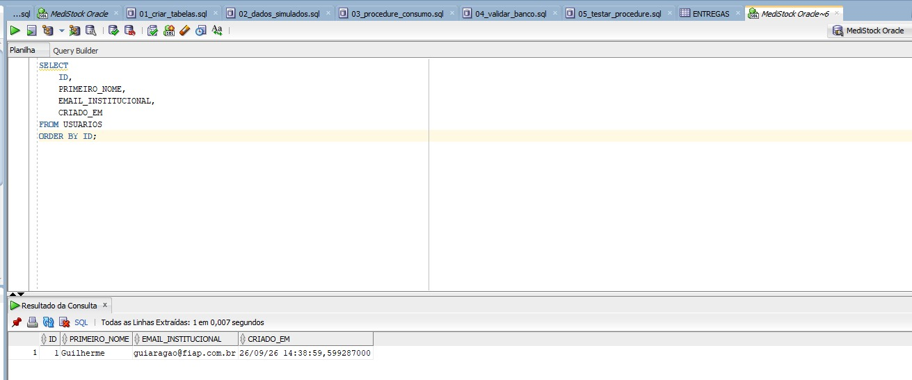

</details>

<details>
<summary><strong>Anexo 4 — Inserção do token na autorização do Swagger</strong></summary>

Preenchimento do campo `Value` da autorização `bearerAuth`, utilizada nas rotas protegidas.

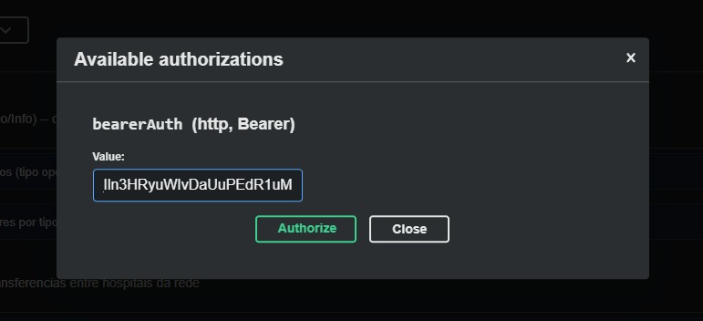

</details>

<details>
<summary><strong>Anexo 5 — Token autorizado</strong></summary>

O Swagger apresenta o estado `Authorized`, permitindo o envio do token nas requisições protegidas.

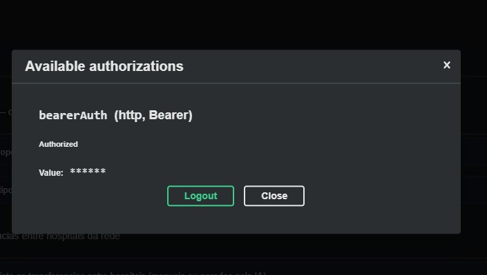

</details>

<details>
<summary><strong>Anexo 6 — GET autenticado em /api/hospitais</strong></summary>

A chamada inclui o cabeçalho de autorização e retorna HTTP `200` com os hospitais de demonstração.

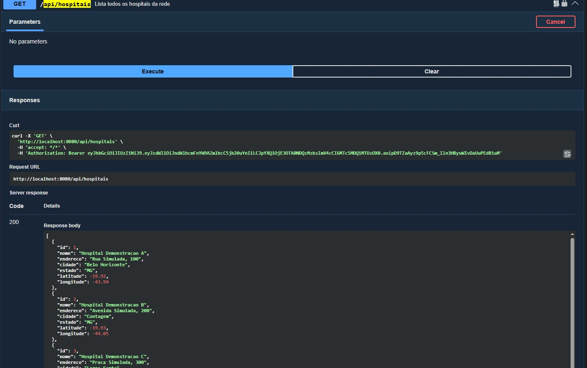

</details>

<details>
<summary><strong>Anexo 7 — Procedure PR_REGISTRAR_CONSUMO com status VALID</strong></summary>

A consulta a `USER_OBJECTS` confirma que a procedure está compilada e válida no schema conectado.

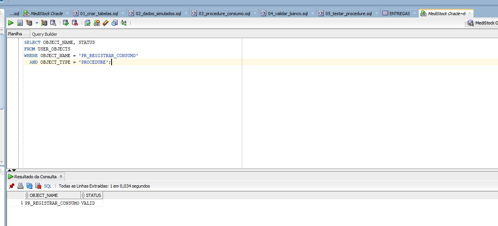

</details>

<details>
<summary><strong>Anexo 8 — Testes PL/SQL concluídos com sucesso</strong></summary>

A saída do script confirma a inserção válida, a rejeição de quantidade negativa, a rejeição de hospital inexistente e o rollback com preservação da contagem inicial.

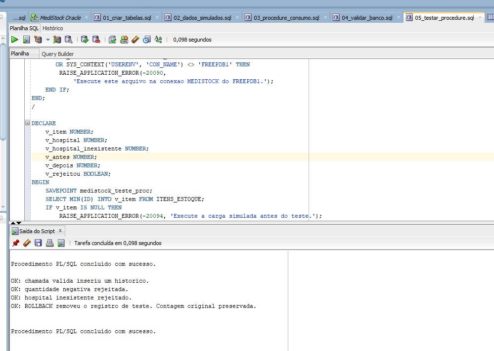

</details>

<details>
<summary><strong>Anexo 9 — Requisição de registro de histórico de consumo</strong></summary>

O corpo de `POST /api/historico-consumo` informa item `1`, hospital `1`, referência `2026-09` e quantidade `7`. A captura mostra a preparação da operação de histórico associada ao item.

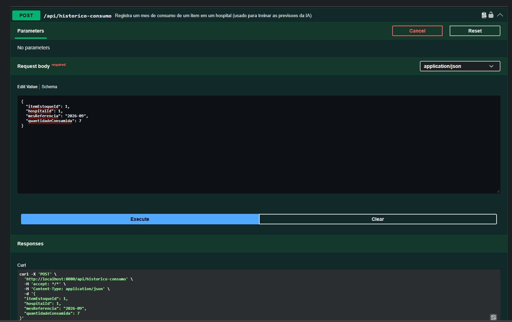

</details>

<details>
<summary><strong>Anexo 10 — Contagem anterior: 72 históricos</strong></summary>

A consulta `COUNT(*)` em `HISTORICO_CONSUMO` retorna `72` antes da inclusão demonstrada.

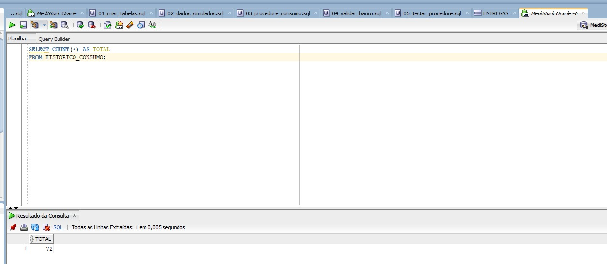

</details>

<details>
<summary><strong>Anexo 11 — Contagem posterior: 73 históricos</strong></summary>

A mesma consulta retorna `73` após a inclusão, registrando o acréscimo de uma linha.

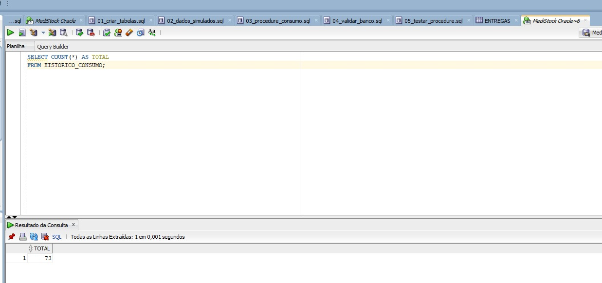

</details>

<details>
<summary><strong>Anexo 12 — Conferência do consumo persistido</strong></summary>

A consulta exibe o registro de ID `221`, vinculado ao item `1` e ao hospital `1`, com referência `2026-09-01` e quantidade consumida `7`.

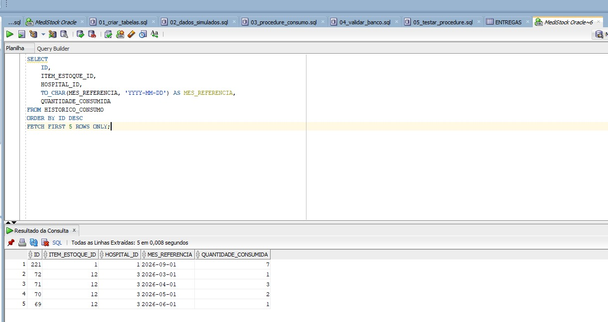

</details>

## Apoio do Antigravity

O Antigravity foi utilizado como apoio ao desenvolvimento local: configuração do perfil Oracle, adequação das dependências, integração da chamada PL/SQL, tratamento de validações e análise dos erros de compilação e execução.

A validação foi realizada no ambiente do projeto, usando o Swagger para as requisições e o SQL Developer para conferir os objetos e os dados persistidos. As capturas acima registram os resultados dessa execução.

## Diagnóstico rápido

| Sintoma | Verificação |
| --- | --- |
| `release version 25 not supported` | Conferir o JDK em `java -version`, `javac -version` e `.\mvnw.cmd -version`. O projeto requer Java 25. |
| Driver Oracle não encontrado no Maven | Conferir `ojdbc17:23.26.2.0.0` e executar `.\mvnw.cmd -U -DskipTests package`. |
| `ORA-12505` no SQL Developer | Usar nome do serviço `FREEPDB1`, host `localhost` e porta `1521`. |
| HTTP `403` em uma rota protegida | Autorizar um token válido no Swagger e conferir o cabeçalho `Authorization`. |
| Erro de validação do schema | Conferir a conexão `MEDISTOCK`, os scripts implantados e os tipos definidos no dicionário. |
| Procedure ausente ou `INVALID` | Executar o script 03 na conexão correta e consultar `USER_ERRORS`. |

## Referências

- [Repositório base MediStock_Back](https://github.com/luanaestanislau/MediStock_Back)
- [Oracle — CREATE TABLE](https://docs.oracle.com/en/database/oracle/oracle-database/26/sqlrf/CREATE-TABLE.html)
- [Oracle — tipos de dados](https://docs.oracle.com/en/database/oracle/oracle-database/26/sqlrf/Data-Types.html)
- [Oracle — CREATE PROCEDURE](https://docs.oracle.com/en/database/oracle/oracle-database/26/lnpls/CREATE-PROCEDURE-statement.html)
- [Oracle JDBC — primeiros passos](https://www.oracle.com/database/technologies/getting-started-using-jdbc.html)
- [Spring — JdbcTemplate](https://docs.spring.io/spring-framework/reference/data-access/jdbc/core.html)
- [Spring Boot — execução pelo Maven](https://docs.spring.io/spring-boot/maven-plugin/run.html)
- [GitHub — README e imagens com caminhos relativos](https://docs.github.com/en/repositories/managing-your-repositorys-settings-and-features/customizing-your-repository/about-readmes)

