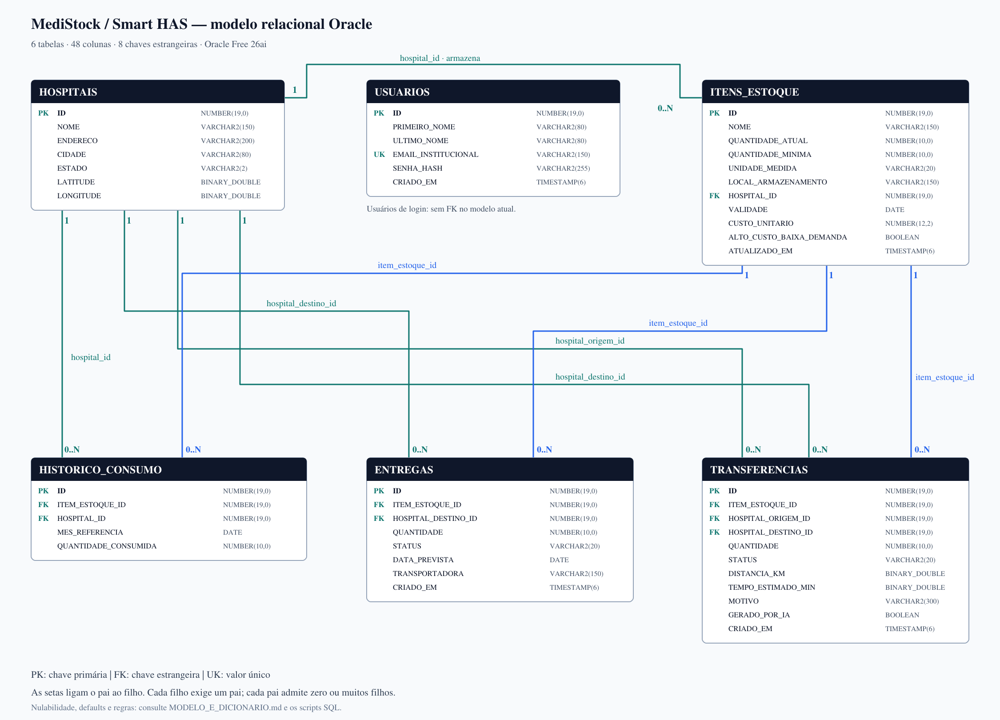
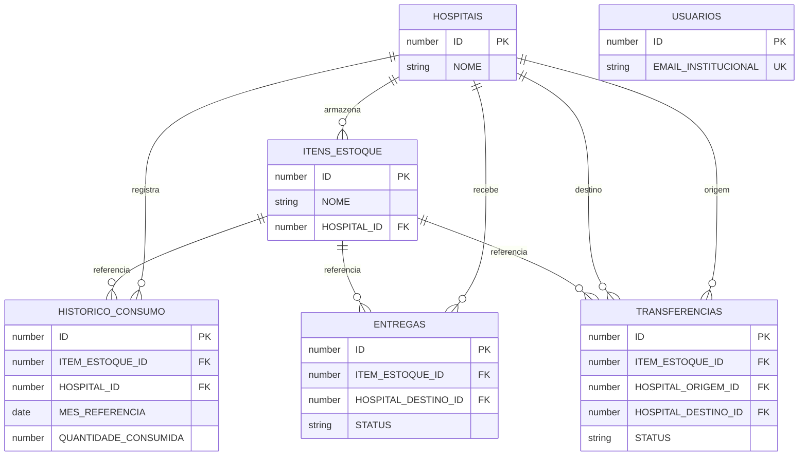

# Modelo Oracle do MediStock / Smart HAS

Base: repositório `luanaestanislau/MediStock_Back`, commit `083ba6a56216cfa030a6e229df9e307c76a53888`, conferido em 26/09/2026.

O modelo foi implantado no ambiente local Oracle da atividade. As evidências de cadastro, consultas, procedure válida, testes PL/SQL e persistência do consumo estão reunidas no [README](../README.md#evidencias). Os scripts SQL desta entrega são a referência para reproduzir a estrutura.

## DER — chaves e cardinalidades

Cada vínculo é 1:N: um registro do pai pode ter zero ou muitos filhos; cada filho aponta para exatamente um pai em cada FK. A tabela USUARIOS é independente porque o código atual não a relaciona a um hospital. O desenho mostra as chaves; o dicionário abaixo lista todas as colunas.

## Decisões de modelagem

- Seis entidades correspondem às seis tabelas; os nomes seguem as anotações JPA e a conversão camelCase para snake_case do Spring Boot.
- Todos os IDs usam identidade Oracle compatível com `GenerationType.IDENTITY`. A carga omite IDs e recupera os gerados com `RETURNING`, evitando conflito com cadastros futuros.
- `Long` vira `NUMBER(19,0)`, `Integer` vira `NUMBER(10,0)`, `Double` vira `BINARY_DOUBLE`, `BigDecimal(12,2)` vira `NUMBER(12,2)`.
- `boolean` usa `BOOLEAN`, disponível no Oracle Free 26ai. O script não foi feito para Oracle 19c ou 21c.
- Strings usam `VARCHAR2(... CHAR)`. `LocalDate` usa `DATE` e `LocalDateTime` usa `TIMESTAMP(6)`.
- As FKs preservam os relacionamentos do código. Não há exclusão em cascata: referências precisam ser tratadas antes de excluir os pais.
- Quantidades, custos e estados logísticos têm constraints. Há oito índices de suporte às FKs e consultas de histórico, além dos índices das PKs e da unicidade de e-mail.
- O histórico preserva a possibilidade de registrar a demanda de um item em outro hospital, usada pela análise de redistribuição. A FK do histórico não é obrigada a repetir o hospital atual do estoque.
- Não foi adicionada unicidade por item/hospital/mês: o serviço original permite vários registros. A procedure também preserva a data recebida; a carga usa o primeiro dia do mês por convenção.
- Os níveis de estoque e os alertas são calculados a partir dos dados; não criamos tabelas extras para resultados derivados.
- O requisito de dados simulados é atendido com históricos e dados do domínio de logística hospitalar: hospitais, itens, entregas e transferências.
- Entregas e transferências são registros logísticos. No código atual, alterar o status não movimenta automaticamente o saldo; a carga e a procedure não acrescentam esse comportamento.

## Dicionário físico completo

### USUARIOS

| Coluna | Tipo Oracle | Permite NULL | Chave / descrição |
|---|---|---|---|
| `ID` | `NUMBER(19,0)` | Não | PK. Chave primária; gerada pelo Oracle. |
| `PRIMEIRO_NOME` | `VARCHAR2(80 CHAR)` | Não | Primeiro nome do usuário. |
| `ULTIMO_NOME` | `VARCHAR2(80 CHAR)` | Não | Sobrenome do usuário. |
| `EMAIL_INSTITUCIONAL` | `VARCHAR2(150 CHAR)` | Não | UNIQUE. E-mail institucional único; a API normaliza para minúsculas. |
| `SENHA_HASH` | `VARCHAR2(255 CHAR)` | Não | Hash BCrypt produzido pelo cadastro da API. |
| `CRIADO_EM` | `TIMESTAMP(6)` | Não | Data e hora de criação, sem fuso no modelo atual. |

### HOSPITAIS

| Coluna | Tipo Oracle | Permite NULL | Chave / descrição |
|---|---|---|---|
| `ID` | `NUMBER(19,0)` | Não | PK. Chave primária; gerada pelo Oracle. |
| `NOME` | `VARCHAR2(150 CHAR)` | Não | Nome do hospital. |
| `ENDERECO` | `VARCHAR2(200 CHAR)` | Sim | Endereço do hospital. |
| `CIDADE` | `VARCHAR2(80 CHAR)` | Sim | Cidade. |
| `ESTADO` | `VARCHAR2(2 CHAR)` | Sim | Sigla da unidade federativa. |
| `LATITUDE` | `BINARY_DOUBLE` | Não | Coordenada para cálculos geográficos. |
| `LONGITUDE` | `BINARY_DOUBLE` | Não | Coordenada para cálculos geográficos. |

### ITENS_ESTOQUE

| Coluna | Tipo Oracle | Permite NULL | Chave / descrição |
|---|---|---|---|
| `ID` | `NUMBER(19,0)` | Não | PK. Chave primária; gerada pelo Oracle. |
| `NOME` | `VARCHAR2(150 CHAR)` | Não | Nome do insumo. |
| `QUANTIDADE_ATUAL` | `NUMBER(10,0)` | Não | Saldo atual; não negativo. |
| `QUANTIDADE_MINIMA` | `NUMBER(10,0)` | Não | Limite mínimo do estoque; não negativo. |
| `UNIDADE_MEDIDA` | `VARCHAR2(20 CHAR)` | Sim | Unidade usada para as quantidades. |
| `LOCAL_ARMAZENAMENTO` | `VARCHAR2(150 CHAR)` | Sim | Local do item dentro do hospital. |
| `HOSPITAL_ID` | `NUMBER(19,0)` | Não | FK → HOSPITAIS.ID; local atual do item. |
| `VALIDADE` | `DATE` | Sim | Data de validade. |
| `CUSTO_UNITARIO` | `NUMBER(12,2)` | Sim | Custo unitário; não negativo. |
| `ALTO_CUSTO_BAIXA_DEMANDA` | `BOOLEAN` | Não | Indica elegibilidade para análise de redistribuição. |
| `ATUALIZADO_EM` | `TIMESTAMP(6)` | Sim | Última atualização; a API atualiza via @PreUpdate. |

### HISTORICO_CONSUMO

| Coluna | Tipo Oracle | Permite NULL | Chave / descrição |
|---|---|---|---|
| `ID` | `NUMBER(19,0)` | Não | PK. Chave primária; gerada pelo Oracle. |
| `ITEM_ESTOQUE_ID` | `NUMBER(19,0)` | Não | FK → ITENS_ESTOQUE.ID. |
| `HOSPITAL_ID` | `NUMBER(19,0)` | Não | FK → HOSPITAIS.ID; hospital que registrou a demanda. |
| `MES_REFERENCIA` | `DATE` | Não | Referência do consumo; a carga usa o primeiro dia do mês. |
| `QUANTIDADE_CONSUMIDA` | `NUMBER(10,0)` | Não | Quantidade consumida registrada; não negativa. |

### ENTREGAS

| Coluna | Tipo Oracle | Permite NULL | Chave / descrição |
|---|---|---|---|
| `ID` | `NUMBER(19,0)` | Não | PK. Chave primária; gerada pelo Oracle. |
| `ITEM_ESTOQUE_ID` | `NUMBER(19,0)` | Não | FK → ITENS_ESTOQUE.ID. |
| `HOSPITAL_DESTINO_ID` | `NUMBER(19,0)` | Não | FK → HOSPITAIS.ID. |
| `QUANTIDADE` | `NUMBER(10,0)` | Não | Quantidade da entrega; maior que zero. |
| `STATUS` | `VARCHAR2(20 CHAR)` | Não | PENDENTE, EM_ROTA, CONCLUIDA ou CANCELADA. |
| `DATA_PREVISTA` | `DATE` | Sim | Data prevista para a entrega. |
| `TRANSPORTADORA` | `VARCHAR2(150 CHAR)` | Sim | Nome da transportadora. |
| `CRIADO_EM` | `TIMESTAMP(6)` | Sim | Data e hora de criação. |

### TRANSFERENCIAS

| Coluna | Tipo Oracle | Permite NULL | Chave / descrição |
|---|---|---|---|
| `ID` | `NUMBER(19,0)` | Não | PK. Chave primária; gerada pelo Oracle. |
| `ITEM_ESTOQUE_ID` | `NUMBER(19,0)` | Não | FK → ITENS_ESTOQUE.ID. |
| `HOSPITAL_ORIGEM_ID` | `NUMBER(19,0)` | Não | FK → HOSPITAIS.ID; origem. |
| `HOSPITAL_DESTINO_ID` | `NUMBER(19,0)` | Não | FK → HOSPITAIS.ID; destino. |
| `QUANTIDADE` | `NUMBER(10,0)` | Não | Quantidade a transferir; maior que zero. |
| `STATUS` | `VARCHAR2(20 CHAR)` | Não | PENDENTE, EM_ROTA, CONCLUIDA ou CANCELADA. |
| `DISTANCIA_KM` | `BINARY_DOUBLE` | Sim | Distância estimada em quilômetros. |
| `TEMPO_ESTIMADO_MIN` | `BINARY_DOUBLE` | Sim | Tempo estimado em minutos. |
| `MOTIVO` | `VARCHAR2(300 CHAR)` | Sim | Justificativa da transferência. |
| `GERADO_POR_IA` | `BOOLEAN` | Não | Indica se a origem do registro foi uma sugestão de IA. |
| `CRIADO_EM` | `TIMESTAMP(6)` | Sim | Data e hora de criação. |

## Procedure PL/SQL

`PR_REGISTRAR_CONSUMO(item_id, hospital_id, data_referencia, quantidade)` valida entradas e referências e insere uma linha em `HISTORICO_CONSUMO`.

A procedure insere o histórico e preserva o saldo de estoque. O chamador controla a transação: a rotina não contém `COMMIT` ou `ROLLBACK`. No fluxo de integração Oracle documentado, o serviço Java usa `@Transactional` e o gravador Oracle chama a procedure uma única vez, com os quatro parâmetros. Os testes de banco exercitam inserção, rejeição de valores inválidos e reversão pelo chamador.

| Código | Significado |
|---|---|
| -20001 | IDs inválidos. |
| -20002 | Quantidade nula, negativa, fracionária ou fora de Java Integer. |
| -20003 | Data de referência ausente. |
| -20004 | Item inexistente. |
| -20005 | Hospital inexistente. |

## Referências técnicas

- [Código do MediStock](https://github.com/luanaestanislau/MediStock_Back/tree/083ba6a56216cfa030a6e229df9e307c76a53888)
- [Oracle CREATE USER](https://docs.oracle.com/en/database/oracle/oracle-database/26/sqlrf/CREATE-USER.html)
- [Oracle CREATE TABLE e IDENTITY](https://docs.oracle.com/en/database/oracle/oracle-database/26/sqlrf/CREATE-TABLE.html)
- [Oracle tipos de dados e BOOLEAN](https://docs.oracle.com/en/database/oracle/oracle-database/26/sqlrf/Data-Types.html)
- [Hibernate OracleDialect](https://github.com/hibernate/hibernate-orm/blob/main/hibernate-core/src/main/java/org/hibernate/dialect/OracleDialect.java)
- [Hibernate: opção de tipos binários, padrão desde 7.0](https://github.com/hibernate/hibernate-orm/blob/main/hibernate-core/src/main/java/org/hibernate/cfg/DialectSpecificSettings.java)
- [Oracle JDBC Quick Start](https://www.oracle.com/database/technologies/getting-started-using-jdbc.html)
